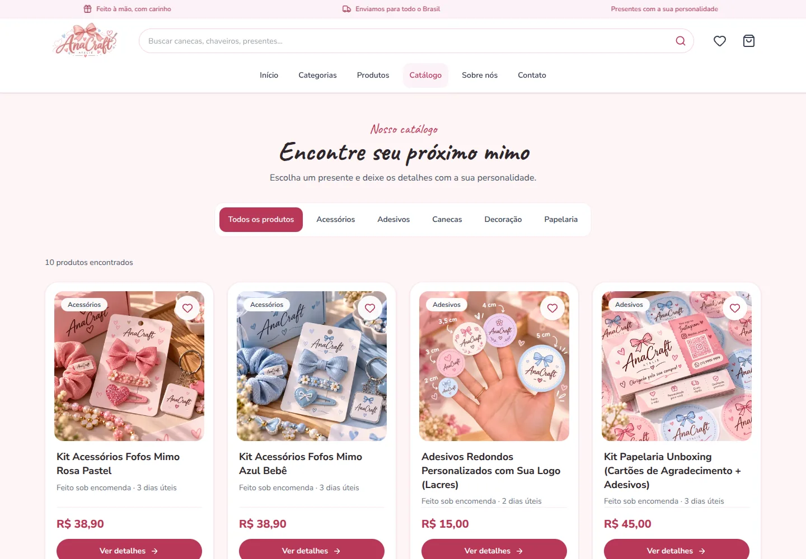
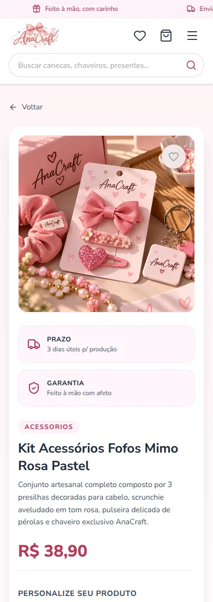

# Ateliê AnaCraft

Loja virtual demonstrativa de produtos artesanais personalizados, desenvolvida por **Cauã Rodolpho** com React e TypeScript. O projeto reúne catálogo, busca, favoritos, personalização de produtos e um fluxo de compra até a confirmação.

O objetivo foi construir uma aplicação front-end com telas conectadas e estado compartilhado, cuidando tanto das regras do carrinho quanto da experiência em celulares, tablets e computadores.

[Site na Vercel](https://loja-atelie-phi.vercel.app/) · [Código no GitHub](https://github.com/CauaRodolpho/Loja-Atelie) · [Meu LinkedIn](https://www.linkedin.com/in/cau%C3%A3-rodolpho/)

> A revisão mais recente está no [ambiente de revisão](https://atelie-anacraft-caua.rodolfinhom5.chatgpt.site), com acesso restrito ao proprietário. O GitHub e a Vercel precisam receber estes arquivos para refletir esta versão.

## Preview

### Página inicial no desktop


### Catálogo



### Celular e personalização

<table>
  <tr>
    <td align="center"><strong>Home no celular</strong></td>
    <td align="center"><strong>Personalização no celular</strong></td>
  </tr>
  <tr>
    <td align="center"></td>
    <td align="center"></td>
  </tr>
</table>

Capturas da aplicação nesta revisão, usando produtos de demonstração. As ilustrações dos banners foram criadas com apoio de IA e adaptadas para desktop e celular.

## O que funciona

- **Catálogo e busca:** filtros por categoria e pesquisa por nome, com sugestões no cabeçalho. A busca ignora diferenças de acentuação e preserva os filtros na URL.
- **Personalização:** cada produto define seus campos obrigatórios, opções e quantidade mínima.
- **Carrinho:** inclusão, remoção, alteração de quantidade e cálculo dos valores. Produtos com personalizações diferentes permanecem separados.
- **Favoritos:** seleção pelo catálogo ou pela página do produto, com painel próprio e contador no cabeçalho.
- **Persistência local:** carrinho e favoritos são mantidos no mesmo navegador entre acessos.
- **Checkout demonstrativo:** formulário com entrega ou retirada, validação dos campos e confirmação com o resumo dos produtos.
- **Navegação:** páginas de catálogo, produto, sobre, checkout, confirmação e rota para endereço não encontrado.

## Tecnologias

| Tecnologia | Uso no projeto |
| --- | --- |
| React + TypeScript | Componentes, estado e tipos de produtos, personalizações e pedidos |
| GSAP | Entrada sincronizada da imagem e do texto nos slides da hero |
| Vite | Servidor de desenvolvimento e build de produção |
| Tailwind CSS + CSS | Estilos, pontos de adaptação e animações |
| React Router | Rotas, parâmetros de produto, filtros na URL e estado da confirmação |
| Context API | Compartilhamento do carrinho e dos favoritos |
| LocalStorage | Persistência dos dados no navegador |
| Lucide React | Ícones da interface |
| Fontsource | Fontes Caveat e Nunito Sans servidas junto com a aplicação |
| ESLint | Análise estática do código |

As versões e dependências estão em `package.json` e `pnpm-lock.yaml`.

## Decisões técnicas e desafios

### Carrinho com produtos personalizados

Comparar apenas o identificador do produto não seria suficiente: duas unidades da mesma caneca podem ter nomes diferentes. O agrupamento considera o produto, as personalizações e a referência de imagem. As entradas dos campos são ordenadas antes da comparação, evitando separar itens iguais apenas pela ordem dos dados.

### Estado compartilhado com Context API

O cabeçalho, os cards, os painéis e o checkout precisam acessar o mesmo carrinho e os mesmos favoritos. Os providers concentram essas operações, enquanto hooks oferecem acesso aos componentes. Para o tamanho atual da aplicação, essa estrutura atende ao fluxo sem acrescentar uma biblioteca de estado global.

### Persistência e seus limites

O LocalStorage mantém o carrinho e os favoritos no dispositivo. A leitura trata erros de JSON, recupera os produtos pelo catálogo atual e descarta registros inválidos. Os favoritos são deduplicados, e preços e totais do carrinho são recalculados ao restaurar os itens; falhas de escrita não interrompem o uso do estado em memória. Essa persistência não sincroniza dispositivos nem substitui validação em um servidor.

### Imagens e layout no celular

Os banners horizontais precisavam de outra composição em telas estreitas. O elemento `picture` seleciona três versões verticais abaixo de 1024 px. No celular, o texto fica acima da imagem; no desktop, ocupa o lado livre da composição. Os arquivos são comprimidos em WebP, e os cards usam variantes menores das imagens dos produtos.

Os cards também usam consultas de contêiner para reorganizar preço e botão conforme o espaço disponível, em vez de depender apenas da largura da tela.

### Busca e rotas

Categoria e termo de busca ficam nos parâmetros da URL, permitindo abrir diretamente resultados como `/catalogo?cat=canecas` ou `/catalogo?q=caneca`. Na confirmação, o resumo é transmitido pelo estado da navegação. Não há histórico de pedidos salvo em um banco; abrir a rota sem esse estado leva ao catálogo.

## Responsividade e acessibilidade

- Menu compacto em telas menores e navegação completa a partir de 1280 px.
- Categorias e produtos reorganizados em colunas conforme a largura disponível.
- Painéis de carrinho e favoritos com controle de foco, fechamento por Escape e bloqueio da rolagem do fundo.
- Campos com rótulos associados, foco visível e validações antes de concluir ações.
- Preferência de movimento reduzido respeitada nas animações.
- Carrossel com setas, indicadores acessíveis por teclado e troca de slides ao deslizar o dedo. Pausa durante foco, toque ou interação com o mouse, preservando a rolagem vertical da página.

## Como rodar

Requisitos: **Node.js 22.12 ou superior** e **pnpm**.

Na pasta do projeto:

```bash
pnpm install --frozen-lockfile
pnpm dev
```

Abra o endereço mostrado no terminal, normalmente `http://localhost:5173`.

| Comando | Finalidade |
| --- | --- |
| `pnpm dev` | Inicia o desenvolvimento local |
| `pnpm build` | Verifica o TypeScript e gera `dist` |
| `pnpm lint` | Executa o ESLint |
| `pnpm preview` | Serve o build localmente |

Não é necessário configurar banco de dados, chaves de API ou arquivo `.env` para executar esta versão.

## Como experimentar o fluxo

1. Abra o catálogo e escolha um produto.
2. Preencha as opções de personalização e adicione ao carrinho.
3. Adicione o mesmo produto com outra personalização para observar a separação dos itens.
4. Altere a quantidade, favorite um produto e recarregue a página para conferir a persistência.
5. No checkout, use dados fictícios e escolha entrega ou retirada.
6. Confirme a simulação e confira o resumo. O carrinho é limpo ao finalizar.

## Organização

```text
src/
  assets/       Banners, marca, categorias e imagens dos produtos
  components/   Cards, painéis e componentes compartilhados
  context/      Providers de carrinho e favoritos
  data/         Catálogo e categorias
  hooks/        Acesso ao estado e comportamento dos painéis
  layout/       Header, hero, categorias, destaques e footer
  pages/        Telas das rotas
  types/        Tipos de produtos, carrinho e pedidos
  utils/        Utilitários de formatação
  App.tsx       Providers e rotas
  global.css    Tema e estilos compartilhados
docs/
  images/       Capturas usadas neste README
```

## Verificações

O projeto passou por build, análise com ESLint e conferências de navegação e responsividade durante o desenvolvimento, incluindo larguras de 320 a 1440 px. Isso não representa uma certificação de acessibilidade nem cobertura completa de testes. Esta versão ainda não inclui uma suíte automatizada de regressão no repositório.

## Limites e próximos passos

Esta aplicação demonstra o **front-end de uma loja**. Não há backend, autenticação, pagamento, controle real de estoque, cálculo de frete ou envio de encomendas. Produtos e preços são definidos no código, e o número exibido na confirmação identifica apenas a simulação.

Para uma operação real, os próximos passos seriam integrar uma API, validar preços e pedidos no servidor, persistir os pedidos em banco de dados e conectar pagamento e frete. Testes automatizados dos fluxos de personalização e checkout também ajudariam a proteger essas regras em futuras alterações.

## Deploy

`pnpm build` gera a pasta `dist`. Na Vercel, use o preset Vite; o arquivo `vercel.json` mantém o retorno para a aplicação nas rotas internas. O ambiente de revisão usa a mesma saída estática.

## Autor

**Cauã Rodolpho** — desenvolvedor front-end.

[GitHub](https://github.com/CauaRodolpho) · [LinkedIn](https://www.linkedin.com/in/cau%C3%A3-rodolpho/)
